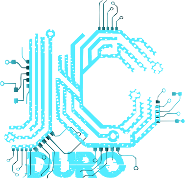

<h1 align="center">¡Hola, soy JcDuro! 
   
Code & ideas 👋!</h1>

  
   
  
  
   
  <b>Desarrollador Full Stack | UI/UX Designer | México & Colombia</b> 
  🚀 Apasionado por la programación, el diseño y la tecnología. Amante de los datos y el software creativo. 
  🌐 <a href="https://jcduro.bexartideas.com/index.php">Mi portafolio</a> • 📍 Cali, Colombia

---

## ⚡ Sobre mí

- 👨‍💻 Desarrollador web con enfoque en frontend y backend: HTML, CSS, JavaScript, PHP, Python, Angular y React.
- 🖌️ Experiencia en diseño de interfaces atractivas y efectos visuales modernos.
- 🐍 Automatización, análisis de datos y aplicaciones interactivas con Python.
- 💡 Siempre aprendiendo: me gustan los retos, la innovación y compartir conocimiento.
- 🌎 Trabajo y colaboro en proyectos open source.
- 🛡️ Fan de la seguridad informática, el código optimizado y la documentación clara.

---

### Idiomas que hablo

---

## 🏆 Proyectos Destacados

- [Gestor de Archivos PHP](https://github.com/jcduro/Gestor_de_Archivos_PHP)  
  Gestor funcional y moderno para administrar archivos en el servidor.

- [Login Neon](https://github.com/jcduro/Login_Neon_CSS_Mysql_PHP)  
  Login con animación de cuadrícula y efecto visual único.

- [Botones Neon](https://github.com/jcduro/Botones_Neon_CSS)  
  12 botones con impacto visual y efectos CSS.

- [Calculadora de IMC](https://github.com/jcduro/Calculadora_de_IMC_Python)  
  App visual para calcular tu índice de masa corporal.

- [Formulario con Tkinter y Excel](https://github.com/jcduro/Formulario_con_Tkinter_y_Excel_Python)  
  Registra y guarda información de usuarios en Excel desde interfaz Python.

---

## 📊 Lenguajes y Herramientas

---

## 🚩 Estadísticas

---

## 📫 ¿Quieres conectar?

- 🔗 [Sitio web](https://jcduro.bexartideas.com/index.php)
- 💬 [Facebook](https://www.facebook.com/profile.php?id=61581848413029)
- 📨 **Correo:** jcreduro@gmail.com

---

## 🏆 Trofeos de GitHub

---

  ¡Gracias por visitar mi perfil! 
  <b>Cada línea de código es una oportunidad para crear algo increíble.</b> 🚀

